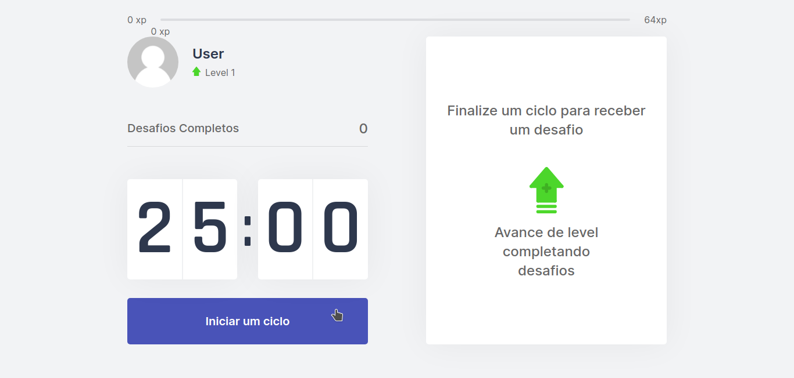
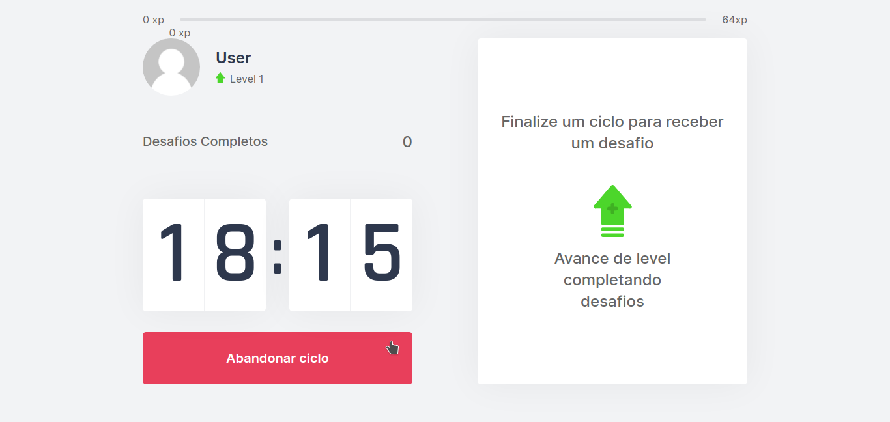
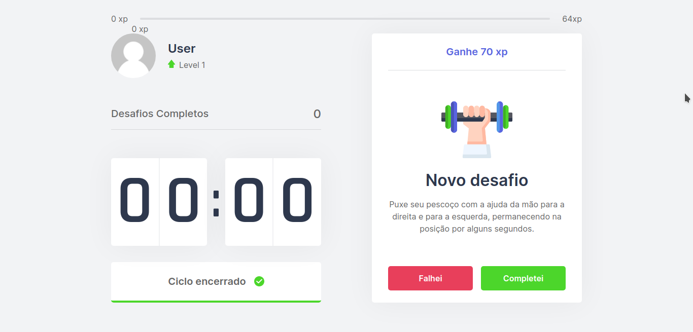
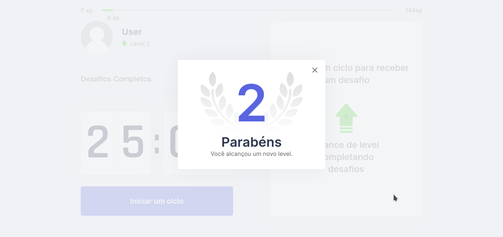
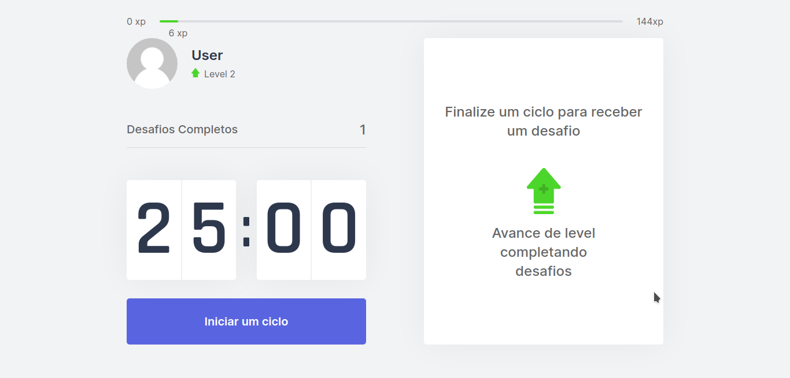

<h1 align="center">moveit</h1>

> Countdown app to take breaks at work and complete challenges exercising eyes, neck and arms

### 🏠 [Homepage](https://github.com/victorqrz/moveit)

## Requirements
- Node >= 14.14.31
- Yarn >= 1.21.0

## Techs
- ReactJS
- NextJS
- TypeScript

## Lints
- Eslint
#

## Installing dev dependencies
In the root directory type the following command:
```sh
yarn
```
## Starting the server
In the root directory type the following command:
```sh
yarn dev
```
## Screenshots





